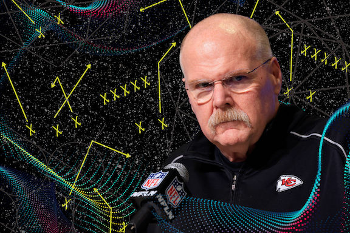
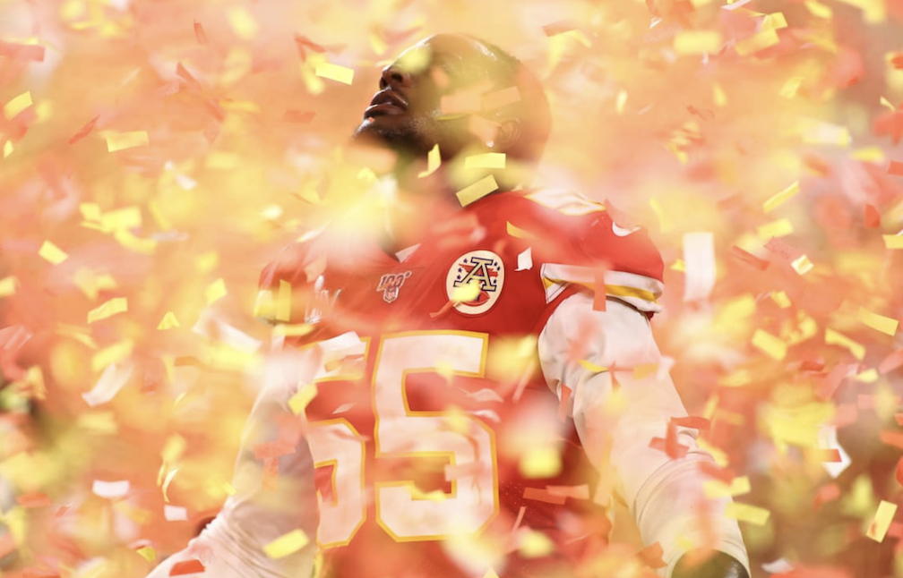

```{r}

library(rmarkdown)
library(gt)
library(tidyquant)
library(timetk)
library(tidyverse)
library(readxl)
library(flextable)
library(janitor)
library(kableExtra)

```


```{r setup, include=FALSE}
knitr::opts_chunk$set(
    echo    = as.logical(params$show_code),
    message = FALSE,
    warning = FALSE
)
```

\newpage

{width=50%}

This is America, gentlemen, you play to win. If it is ping-pong or a hot dog eating contest, you play to win. That is how you go about this business we call Dynasty Fantasy Football. It is all about getting that sweet, sweet taste of victory.

Maybe you won last year. Maybe you didn't deserve to, either. Doesn't matter to me. If you like chocolate cake and you eat a piece, and then you have one dangling in front of your face, you're going to want to eat that too. And hungry dogs run faster. 

This isn't gonna be easy but its gonna be worth it. Building a dynasty team, cultivating these players, it's a lot like a great burger. It’s hard, I mean, you have to execute that thing just the right way. You have to get it to where it’s perfect and juicy when you cut it open but not raw. Then add a nice slice of a Vidalia onion, some mayo, ketchup, a little squirt of mustard - but not too much - pickles, lettuce and tomato and baby I’m ready to roll. 

To put all that together and make it perfect, there’s some time involved. That’s where the real work comes in. You practice, you get it right, you perfect your craft and then when you finally bite into it, hoo boy, that's ecstasy right there. So, that’s why we play. In my book, there isn't a real man alive who doesn't love a good hamburger and a clean hit of ecstasy. Call me old fashioned.

There's a lot of ways to win this league. In some ways you want to keep the roster young. And at the same time you need those veterans who make you feel older. That’s a delicate blend, not unlike sweet and sour pork. 

So go attack this thing, boys. Attack it like I went after a few Chile Rellenos the other night. Because if you get that trophy, it's a special feeling, man. It means it all paid off. It'll mean something to you forever. When you sit back and look at that dick-shaped hunk of metal with your name on it, it brings a smile to your face. It's like a Snickers in the freezer, right? It's treasured.


{fig.align='center'}

\newpage
## The Results 

### Final Standings
<p style="text-align: center;">**All-Time Dynasty Standings & 2022 Final Regular Season Standings**</p>
```{r, echo=FALSE,out.width="49%",out.height="49%",fig.show='hold',fig.align='center', fig.cap="Standings"}
knitr::include_graphics(c("output/history/all_time_standings.png","output/history/2022_standings.png"))
```
\newpage
<p style="text-align: center;">**2021 & 2020 Final Regular Season Standings**</p>
```{r, echo=FALSE,out.width="50%",out.height="50%",fig.show='hold',fig.align='center', fig.cap="Standings"}
knitr::include_graphics(c("output/history/2021_standings.png","output/history/2020_standings.png"))
```
\newpage
### Notable Matchups
<p style="text-align: center;">**Blowouts and Nail Biters**</p>
```{r, echo=FALSE,out.width="50%",out.height="50%",fig.show='hold',fig.align='center', fig.cap="Just Win, Baby!"}
knitr::include_graphics(c("output/history/blowouts.png","output/history/closecalls.png"))
```

### Power Rankings
:::::: {.cols data-latex=""}

::: {.col data-latex="{0.3\textwidth}"}
```{r, figures-side, fig.show="hold", out.width="70%"}
knitr::include_graphics(c("output/history/all_time_power_rank_standings_owner.png","output/history/all_time_power_rank_standings_yearly.png"))
```
:::

::: {.col data-latex="{0.05\textwidth}"}
\ 
<!-- an empty Div (with a white space), serving as
a column separator -->
:::

::: {.col data-latex="{0.65\textwidth}"}
The figure on the left-hand side shows the `power_ranking` data.
Lorem ipsum dolor sit amet, consectetur adipiscing elit, sed do
eiusmod tempor incididunt ut labore et dolore magna aliqua. Ut
enim ad minim veniam, quis nostrud exercitation ullamco laboris
nisi ut aliquip ex ea commodo consequat. Duis aute irure dolor
in reprehenderit in voluptate velit esse cillum dolore eu fugiat
nulla pariatur. Lorem ipsum dolor sit amet, consectetur adipiscing elit, sed do
eiusmod tempor incididunt ut labore et dolore magna aliqua. Ut
enim ad minim veniam, quis nostrud exercitation ullamco laboris
nisi ut aliquip ex ea commodo consequat. Duis aute irure dolor
in reprehenderit in voluptate velit esse cillum dolore eu fugiat
nulla pariatur. 


Lorem ipsum dolor sit amet, consectetur adipiscing elit, sed do
eiusmod tempor incididunt ut labore et dolore magna aliqua. Ut
enim ad minim veniam, quis nostrud exercitation ullamco laboris
nisi ut aliquip ex ea commodo consequat. Duis aute irure dolor
in reprehenderit in voluptate velit esse cillum dolore eu fugiat
nulla pariatur. 

:::
::::::

\newpage
## The Franchises

It's almost Week 1 and these are the final rosters each Franchise has selected, by choice or not, to take the field. 

Anyone of you can build plausible-sounding, 'fact-based' narratives that attempt to explain why your roster is taking home the trophy. Only time will tell. 

Hopefully, 2023 doesn't require a tragic, near-death on live TV to determine its outcome. In a perfect world, it won't end with a tainted, asterisk-bound title. I think that's something we can all agree on - unlike saying, "Congrats, Tommy Tsao!"

With that - on to 2023 and previewing each franchise's 2023 roster, strengths, weaknesses, historical results and rivals. A Dynasty version of Why Your Team Sucks but, unlike Deadspin's review of the NFL, most of your guy's rosters are genuine, Oakland-level dogshit. 

_To preview each team, the following information is aggregated:_

1. 2023 Pre-Draft Roster (Including Various Rankings)

2. 2022 Final Roster (Ranked by Fantasy Points Scored in Line-Up)

3. 2022 Final Schedule Win/Loss 

4. Career Head to Head Records vs League Opponents (All-Time)


_Notes on Methodology:_

1. Ranking, Tier, and ECR Sourced via **FantasyPros**

2. Position Rank and Career Value Sourced via **DynastyProcess.com**

3. Lifetime Value Sourced via **PlayerProfiler** 

4. Bench Players Limited to **Top 10 by FantasyPros Ranking** 

\newpage
### Alanasty
<p style="text-align: center;">**2023 Proj. & 2022 Final Rosters**</p>
```{r, echo=FALSE,out.width="70%",out.height="70%",fig.show='hold',fig.align='center', fig.cap="The Ballers"}
knitr::include_graphics(c("output/2023/dynasty_roster_Alanasty.png","output/2022/dynasty_roster_Alanasty.png"))
```
\newpage
<p style="text-align: center;">**2022 Schedule & Career Head to Head**</p>
```{r, echo=FALSE,out.width="48%",out.height="48%",fig.show='hold',fig.align='center', fig.cap="The Outcomes"}
knitr::include_graphics(c("output/headtohead/JP_head_to_head.png","output/py_schedule/season_results_JP.png"))
```
\newpage
### The Iron Banki
<p style="text-align: center;">**2023 Proj. & 2022 Final Rosters**</p>
```{r, echo=FALSE,out.width="70%",out.height="70%",fig.show='hold',fig.align='center', fig.cap="The Ballers"}
knitr::include_graphics(c("output/2023/dynasty_roster_Naaderbanki.png","output/2022/dynasty_roster_Naaderbanki.png"))
```
\newpage
<p style="text-align: center;">**2022 Schedule & Career Head to Head**</p>
```{r, echo=FALSE,out.width="48%",out.height="48%",fig.show='hold',fig.align='center', fig.cap="The Outcomes"}
knitr::include_graphics(c("output/headtohead/Naad_head_to_head.png","output/py_schedule/season_results_Naad.png"))
```
\newpage
### Montel's A$$men
<p style="text-align: center;">**2023 Proj. & 2022 Final Rosters**</p>
```{r, echo=FALSE,out.width="70%",out.height="70%",fig.show='hold',fig.align='center', fig.cap="The Ballers"}
knitr::include_graphics(c("output/2023/dynasty_roster_Asmontalvo.png","output/2022/dynasty_roster_Asmontalvo.png"))
```
\newpage
<p style="text-align: center;">**2022 Schedule & Career Head to Head**</p>
```{r, echo=FALSE,out.width="48%",out.height="48%",fig.show='hold',fig.align='center', fig.cap="The Outcomes"}
knitr::include_graphics(c("output/headtohead/Montel_head_to_head.png","output/py_schedule/season_results_Montel.png"))
```
\newpage
### Dick Chubb
<p style="text-align: center;">**2023 Proj. & 2022 Final Rosters**</p>
```{r, echo=FALSE,out.width="70%",out.height="70%",fig.show='hold',fig.align='center', fig.cap="The Ballers"}
knitr::include_graphics(c("output/2023/dynasty_roster_Nhosta.png","output/2022/dynasty_roster_Nhosta.png"))
```
\newpage
<p style="text-align: center;">**2022 Schedule & Career Head to Head**</p>
```{r, echo=FALSE,out.width="48%",out.height="48%",fig.show='hold',fig.align='center', fig.cap="The Outcomes"}
knitr::include_graphics(c("output/headtohead/Hosta_head_to_head.png","output/py_schedule/season_results_Hosta.png"))
```
\newpage
### Andy Reid's Briskett
<p style="text-align: center;">**2023 Proj. & 2022 Final Rosters**</p>
```{r, echo=FALSE,out.width="70%",out.height="70%",fig.show='hold',fig.align='center', fig.cap="The Ballers"}
knitr::include_graphics(c("output/2023/dynasty_roster_Bellist.png","output/2022/dynasty_roster_Bellist.png"))
```
\newpage
<p style="text-align: center;">**2022 Schedule & Career Head to Head**</p>
```{r, echo=FALSE,out.width="48%",out.height="48%",fig.show='hold',fig.align='center', fig.cap="The Outcomes"}
knitr::include_graphics(c("output/headtohead/Tom_head_to_head.png","output/py_schedule/season_results_Tom.png"))
```
\newpage
### Zac GOFFrey
<p style="text-align: center;">**2023 Proj. & 2022 Final Rosters**</p>
```{r, echo=FALSE,out.width="70%",out.height="70%",fig.show='hold',fig.align='center', fig.cap="The Ballers"}
knitr::include_graphics(c("output/2023/dynasty_roster_Zacgeoffray.png","output/2022/dynasty_roster_Zacgeoffray.png"))
```
\newpage
<p style="text-align: center;">**2022 Schedule & Career Head to Head**</p>
```{r, echo=FALSE,out.width="48%",out.height="48%",fig.show='hold',fig.align='center', fig.cap="The Outcomes"}
knitr::include_graphics(c("output/headtohead/Zac_head_to_head.png","output/py_schedule/season_results_Zac.png"))
```
\newpage
### John Wick, M.D.
<p style="text-align: center;">**2023 Proj. & 2022 Final Rosters**</p>
```{r, echo=FALSE,out.width="70%",out.height="70%",fig.show='hold',fig.align='center', fig.cap="The Ballers"}
knitr::include_graphics(c("output/2023/dynasty_roster_Johnwickmd.png","output/2022/dynasty_roster_Johnwickmd.png"))
```
\newpage
<p style="text-align: center;">**2022 Schedule & Career Head to Head**</p>
```{r, echo=FALSE,out.width="48%",out.height="48%",fig.show='hold',fig.align='center', fig.cap="The Outcomes"}
knitr::include_graphics(c("output/headtohead/Aviel_head_to_head.png","output/py_schedule/season_results_Aviel.png"))
```
\newpage
### Conor
<p style="text-align: center;">**2023 Proj. & 2022 Final Rosters**</p>
```{r, echo=FALSE,out.width="70%",out.height="70%",fig.show='hold',fig.align='center', fig.cap="The Ballers"}
knitr::include_graphics(c("output/2023/dynasty_roster_Cpmadden1.png","output/2022/dynasty_roster_Cpmadden1.png"))
```
\newpage
<p style="text-align: center;">**2022 Schedule & Career Head to Head**</p>
```{r, echo=FALSE,out.width="48%",out.height="48%",fig.show='hold',fig.align='center', fig.cap="The Outcomes"}
knitr::include_graphics(c("output/headtohead/Conor_head_to_head.png","output/py_schedule/season_results_Conor.png"))
```
\newpage
### El Randal
<p style="text-align: center;">**2023 Proj. & 2022 Final Rosters**</p>
```{r, echo=FALSE,out.width="70%",out.height="70%",fig.show='hold',fig.align='center', fig.cap="The Ballers"}
knitr::include_graphics(c("output/2023/dynasty_roster_Elrandal.png","output/2022/dynasty_roster_Elrandal.png"))
```
\newpage
<p style="text-align: center;">**2022 Schedule & Career Head to Head**</p>
```{r, echo=FALSE,out.width="48%",out.height="48%",fig.show='hold',fig.align='center', fig.cap="The Outcomes"}
knitr::include_graphics(c("output/headtohead/Randal_head_to_head.png","output/py_schedule/season_results_Randal.png"))
```
\newpage
### General T-sao Chicken
<p style="text-align: center;">**2023 Proj. & 2022 Final Rosters**</p>
```{r, echo=FALSE,out.width="70%",out.height="70%",fig.show='hold',fig.align='center', fig.cap="The Ballers"}
knitr::include_graphics(c("output/2023/dynasty_roster_Ttsao.png","output/2022/dynasty_roster_Ttsao.png"))
```
\newpage
<p style="text-align: center;">**2022 Schedule & Career Head to Head**</p>
```{r, echo=FALSE,out.width="48%",out.height="48%",fig.show='hold',fig.align='center', fig.cap="The Outcomes"}
knitr::include_graphics(c("output/headtohead/Tommy_head_to_head.png","output/py_schedule/season_results_Tommy.png"))
```
### pbpablo
<p style="text-align: center;">**2023 Proj. & 2022 Final Rosters**</p>
```{r, echo=FALSE,out.width="70%",out.height="70%",fig.show='hold',fig.align='center', fig.cap="The Ballers"}
knitr::include_graphics(c("output/2023/dynasty_roster_Pdpablo.png","output/2022/dynasty_roster_Pdpablo.png"))
```
\newpage
<p style="text-align: center;">**2022 Schedule & Career Head to Head**</p>
```{r, echo=FALSE,out.width="48%",out.height="48%",fig.show='hold',fig.align='center', fig.cap="The Outcomes"}
knitr::include_graphics(c("output/headtohead/Patrick_head_to_head.png","output/py_schedule/season_results_Patrick.png"))
```
### slobonmynoblin (RIP)
<p style="text-align: center;">**2023 Proj. & 2022 Final Rosters**</p>
```{r, echo=FALSE,out.width="70%",out.height="70%",fig.show='hold',fig.align='center', fig.cap="The Ballers"}
knitr::include_graphics(c("output/2023/dynasty_roster_Slobonmynoblin.png","output/2022/dynasty_roster_Slobonmynoblin.png"))
```
\newpage
<p style="text-align: center;">**2022 Schedule & Career Head to Head**</p>
```{r, echo=FALSE,out.width="48%",out.height="48%",fig.show='hold',fig.align='center', fig.cap="The Outcomes"}
knitr::include_graphics(c("output/headtohead/Logan_head_to_head.png","output/py_schedule/season_results_Logan.png"))
```